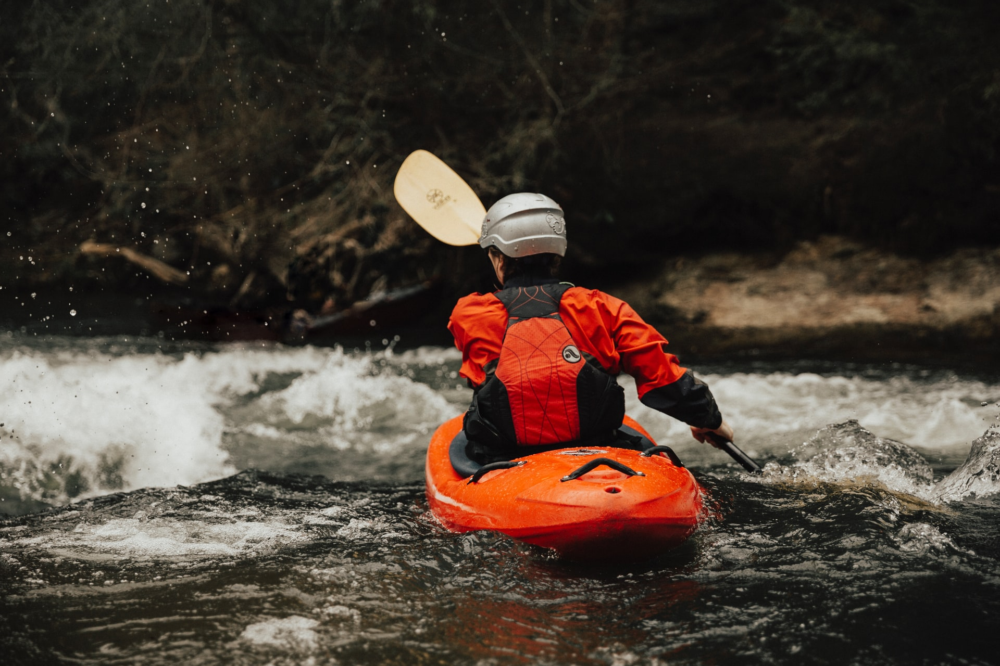

A Propos
--------------------------------------------------------------------------------

L'EVPT (Eaux Vives Pour Tous) est une section associée au club de Canoë-Kayak 
de la [MJC de Sartrouville](#mjc-sartrouville). Elle propose à tous
des créneaux de pratique loisirs sur la rivière artificielle de Cergy-Pontoise.

  - E-mail : 📧 [evpt@mjcsartrouville.asso.fr](mailto:evpt@mjcsartrouville.asso.fr)

  - Facebook : <https://www.facebook.com/EVPTOUS>

Actualités
--------------------------------------------------------------------------------

  - *Vendredi 29 Octobre 2021*

    Bonjour,

    Si vous avez la pagaie qui vous démange, EVPT vous propose de se retrouver 
    pour la dernière de la saison ! 
    

    | 📅 Dimanche 07 novembre 2021 | Volume d'eau                              |
    | ---------------------------- | ----------------------------------------- |
    | 🕐 11h-12h                   | 🌊🌊 2 pompes                             |
    | 🕐 12h-13h                   | 🌊🌊🌊 3 pompes                           |

    Inscription:

    📝 [Formulaire inscription EVPT 07-11-2021](https://docs.google.com/forms/d/e/1FAIpQLScwOe-cKrpR2wKV_Ga_XzVvaTRI-TSNRrZYFiQvJ2fFs3-6vg/viewform)

    Reportez-vous aux [conditions générales](#conditions-générales) pour plus de détails 
    (en particulier, le pass sanitaire est nécessaire pour participer).
    

# Conditions générales
--------------------------------------------------------------------------------

Nos créneaux sont ouverts à tous ceux qui aiment naviguer, dès lors que vous 
êtes autonome ou bien encadré. Les différents types d'embarcations (creeker, 
freestyle, slalom, open canoë, etc.) sont les bienvenus ! 

Les conditions pour participer à ses créneaux sont : 

  - **Etre licencié FFCK** 
    (ou, à défaut, prendre une Carte FFCK « 1 jour » auprès d'un membre 
    de l'EVPT le jour même),

  - **S'inscrire au préalable** au moyen du formulaire en ligne.
    (Les personnes non inscrites au préalable pourront se voir refuser 
    l'accès à la rivière. )

  - **Payer à l'issue du créneau** (rendez-vous sur le parking P3).

### Tarifs

|                              | Prix par personne                         |
| ---------------------------- | ----------------------------------------- |
| 🌊🌊 1h créneau 2 pompes     | 💶 5 €                                    |
| 🌊🌊🌊 1h créneau 3 pompes   | 💶 7 €                                    |
| Non-licencié FFCK            | 💶 +2 € (Carte FFCK « 1 jour »)           |

Ce tarif inclut l’accès à la base de Cergy. 

### Pratique Loisirs & Sécurité

Pour que les sessions se déroulent dans la bonne humeur (et sans bobo 🤕)
malgré la multiplicités des pratiques :

  - Nous ne mettons pas en place de portes de slalom sur le parcours.

  - Le pratiquant déjà engagé dans une action est toujours prioritaire ; 
    soyez vigilants et dans le doute, arrêtez-vous pour évitez les collisions. 
    N'hésitez pas à communiquer !

  - Les pratiquants non autonomes devront être encadrés.

### Accès

Pour accéder à la rivière artificielle :

 1. Rendez-vous à l'[île de loisirs de Cergy Pontoise 📍](https://goo.gl/maps/2vA5fz18Uch7Sh4a8) 

    > Par la route, de Paris : prendre l’autoroute A15, sortie n°9 direction Cergy, 
    > puis suivre le fléchage « les Étangs de Cergy-Neuville ». 
    > Au bout du boulevard de l’Hautil, suivez  le fléchage jaune « entrée Île de loisirs ».
    >
    > Coordonnée GPS :
    >
    >    Ne pas indiquer la rue des Etangs, elle amène dans un cul-de-sac
    >    Indiquez Île de loisirs de Cergy sur Waze ou Google maps
    >
    >     - Latitude : 49.0217870018582
    >
    >     - Longitude : 2.052319049835205
    >
    > Source: <https://cergy-pontoise.iledeloisirs.fr/venir-a-lile-de-loisirs/>

 2. Dirigez-vous ensuite vers le parking P3 (à droite au 1er rond-point) où vous
    pourrez stationner. Puis embarquez sur l'étang de la folie et traversez vers
    [la rivière artificielle📍](https://goo.gl/maps/kxDHpmThyGNV8AQd7).

### 😷 Covid-19

⚠️ **Un pass sanitaire est nécessaire pour participer aux sessions EVPT**

Il devra être présenté lors de l'accès à la rivière artificielle
(et non à l'entrée de l'île de loisirs ou sur le parking P3).

Plus de détails ici: <https://cergy-pontoise.iledeloisirs.fr/covid-19/>

--------------------------------------------------------------------------------

A bientôt sur l'eau !

